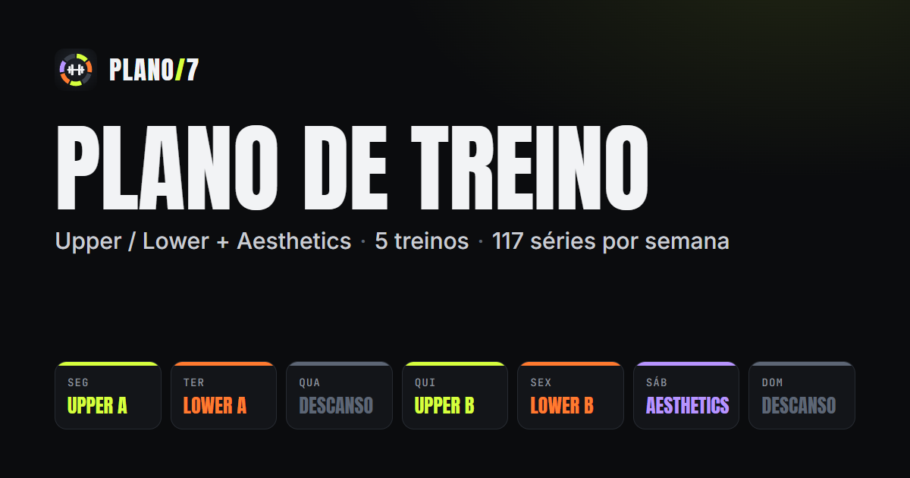
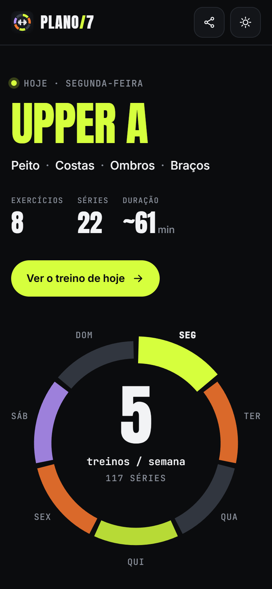
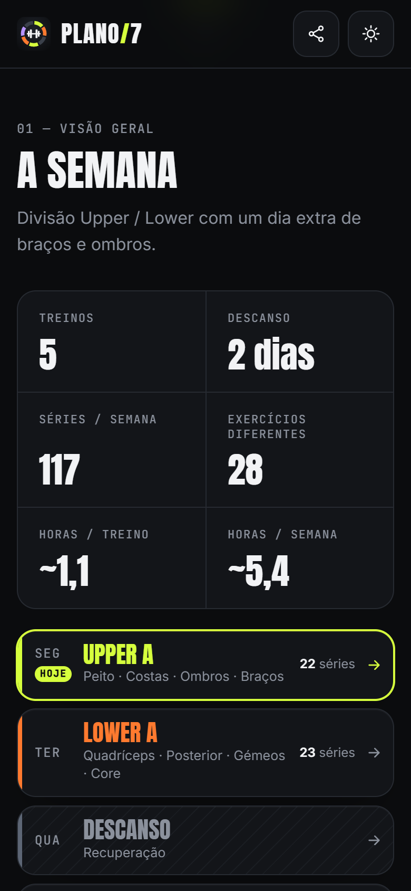
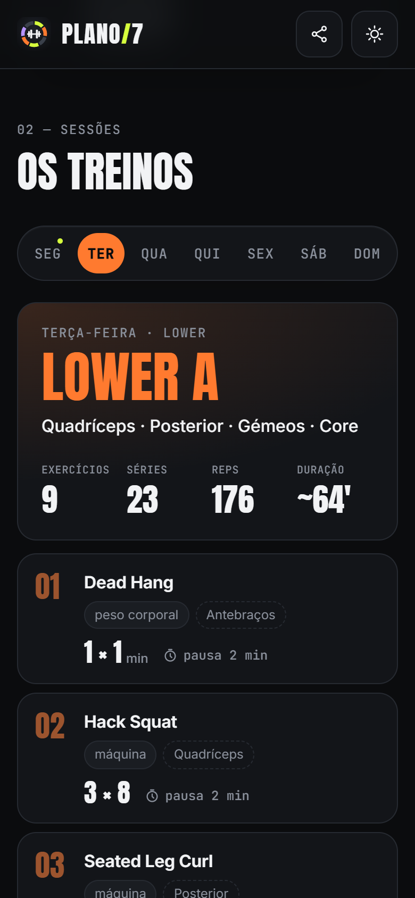
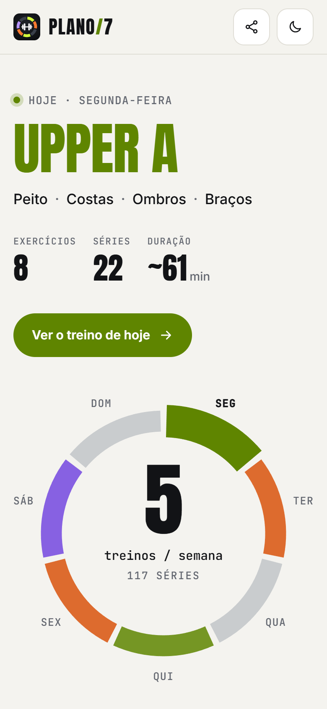
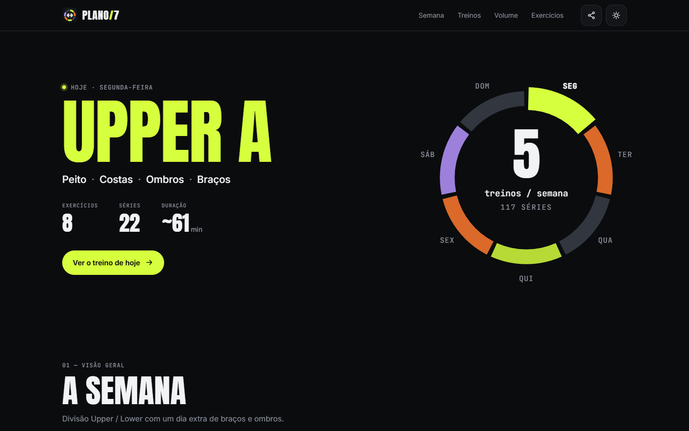

<div align="center">



# Plano de Treino

**O meu plano de treino semanal, num site rápido e bonito para mostrar aos amigos.**

[](https://plano-de-treino.tomaspereira.chatgpt.site)

[](https://github.com/tpereira2005/plano-de-treino/actions/workflows/ci.yml)
[](LICENSE)
[](https://vite.dev)


</div>

---

## Sobre

Divisão **Upper / Lower** com um dia extra de braços e ombros: **5 treinos, 2 dias de descanso, 117 séries por semana.**

| Dia | Treino | Foco |
| --- | --- | --- |
| Segunda | **Upper A** | Peito · Costas · Ombros · Braços |
| Terça | **Lower A** | Quadríceps · Posterior · Gémeos · Core |
| Quarta | Descanso | — |
| Quinta | **Upper B** | Ombros · Costas · Peito · Braços |
| Sexta | **Lower B** | Pernas · Glúteos · Posterior · Core |
| Sábado | **Aesthetics** | Ombros · Bíceps · Tríceps |
| Domingo | Descanso | — |

O site é só para consulta: não tem contas, não guarda progresso e não depende de nenhum servidor.

## Capturas

<table>
  <tr>
    <td align="center"><br /><sub>Treino de hoje</sub></td>
    <td align="center"><br /><sub>A semana</sub></td>
    <td align="center"><br /><sub>Exercícios de cada dia</sub></td>
    <td align="center"><br /><sub>Tema claro</sub></td>
  </tr>
</table>



## Funcionalidades

- **Hoje** — o treino do dia em destaque (ou o próximo, se for dia de descanso) e um anel clicável com a semana.
- **A semana** — treinos, descanso, séries, exercícios diferentes, horas por treino e por semana, e os 7 dias.
- **Os treinos** — cada exercício com equipamento, músculos, séries × repetições e pausa.
- **Volume semanal** — séries por grupo muscular, por tipo de sessão.
- **Exercícios** — os 28 exercícios do plano e os dias em que aparecem.
- **Links diretos** para cada dia (`#/segunda`, `#/terca`, …) e botão de partilha nativo do iPhone.
- **Feito para iPhone** — zonas seguras do notch, alvos de toque grandes, ícone para o ecrã principal, tema claro/escuro.
- **Pré-visualização ao partilhar** — imagem própria no WhatsApp, iMessage e redes sociais.
- **Leve e sem dependências externas** — fontes incluídas no build, nenhum pedido a CDNs, ~6 kB de JavaScript (gzip).

## Começar

Requer **Node.js 20.19+ ou 22.12+** (há um `.nvmrc` com a versão 22).

```bash
npm install
```

```bash
npm run dev
```

| Comando | O que faz |
| --- | --- |
| `npm run dev` | Servidor de desenvolvimento em `http://localhost:5173` |
| `npm run build` | Gera a versão final em `dist/` |
| `npm run preview` | Serve `dist/` localmente para verificar antes de publicar |

## Alterar o plano

Todo o plano está num só ficheiro: [`src/data/plan.js`](src/data/plan.js). O resto do site (semana, contagens, volume, biblioteca) é calculado a partir dele.

```js
ex('Hack Squat', 'máquina', 3, 8, 2),
//  nome          equipamento  séries  reps  pausa (min)
```

Um exercício novo precisa também de uma entrada em `MUSCLES`, no mesmo ficheiro, para contar no gráfico de volume.

## Publicar

1. `npm run build`
2. Publica **o conteúdo da pasta `dist/`** em qualquer alojamento estático.

- Os caminhos são relativos (`base: './'`), por isso funciona na raiz de um domínio ou numa subpasta.
- A navegação usa `#/dia`, por isso não é preciso configurar rewrites.
- Não há chaves, segredos, variáveis de ambiente nem backend.
- Se o domínio mudar, atualiza os URLs absolutos das meta tags `og:` em [`index.html`](index.html), que a pré-visualização de links exige.

## Estrutura

```
├── index.html              estrutura da página e meta tags
├── public/                 ícones, imagem de partilha e site.webmanifest
├── src/
│   ├── data/plan.js        o plano de treino (fonte única)
│   ├── lib/store.js        guarda a preferência de tema no browser
│   ├── main.js             interface
│   └── styles.css          estilos (tema claro/escuro, responsivo)
├── docs/screenshots/       capturas usadas neste README
└── .github/                CI (build a cada push) e Dependabot
```

## Notas

- O "dia de hoje" usa o relógio do dispositivo de quem visita.
- A duração de cada treino é uma estimativa: cerca de 45 s por série mais a pausa indicada.
- Copiar o link exige HTTPS; o iPhone usa o menu de partilha do sistema.

## Licença

[MIT](LICENSE) © 2026 Tomás Pereira
